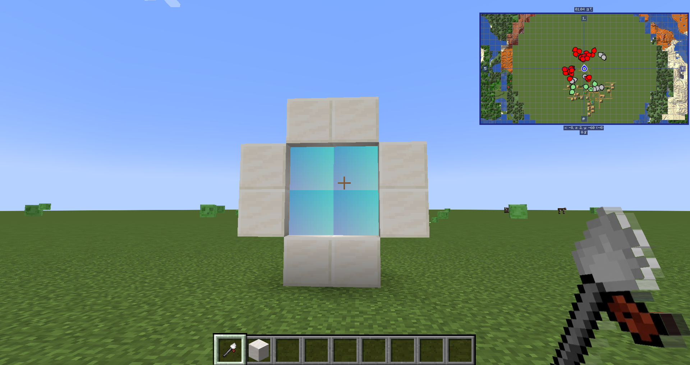

# I am Miner

我是矿工 — 一个为 Minecraft 添加全新矿物维度的 Mod。

I am Miner 为游戏添加一个富含矿物的全新维度——**矿工天堂**，包含 13 种新矿石、10 种材料等级的完整工具和防具体系，以及一套维度传送门系统。同时，矿工天堂支持与其他模组矿石的自动兼容与动态平衡。

原版 MOD 低版本由 [Gim949](https://www.mcmod.cn/class/2627.html) 制作，本项目将其移植至 **Minecraft 1.20.1（未来可能会支持更多版本）**，并在此基础上进行了大量重构与功能扩展。

***

## 玩法概览

### 新维度：矿工天堂

一个空旷世界，矿石生成密度为**默认的 5 倍**（可配置），没有怪物刷新，永夜环境，是纯粹的挖矿天堂。矿工天堂支持**自动生成其他模组的矿石**，并通过动态平衡系统智能调整各类矿石的分布。

| 属性    | 值                      |
| ----- | ---------------------- |
| 地形    | 类洞穴世界（like caves）      |
| 天空    | 永夜（无天光）                |
| 怪物    | 无                      |
| 矿石密度  | 常规的 5 倍（可配置，支持按模组独立配置） |
| 床/重生锚 | 不可用                    |
| 跨模组兼容 | 自动生成其他模组矿石并动态平衡        |

### 13 种新矿石

| 矿石  | 生成高度     | 每区块频率 | 挖掘等级 |
| --- | -------- | ----- | ---- |
| 铝土矿 | -64\~320 | 5     | 石镐   |
| 铬铁矿 | -64\~320 | 3     | 铁镐   |
| 萤石矿 | -64\~320 | 2     | 钻石镐  |
| 铅矿  | -64\~320 | 5     | 石镐   |
| 铜矿  | -64\~320 | 5     | 石镐   |
| 锡矿  | -64\~320 | 5     | 石镐   |
| 银矿  | -64\~320 | 3     | 铁镐   |
| 铂金矿 | -64\~320 | 2     | 钻石镐  |
| 紫晶矿 | -64\~320 | 3     | 铁镐   |
| 翡翠矿 | -64\~320 | 3     | 铁镐   |
| 石膏矿 | -64\~320 | 5     | 铁镐   |
| 蛋白矿 | -64\~320 | 2     | 钻石镐  |
| 神秘矿 | -64\~320 | 3     | 钻石镐  |

### 10 种材料等级

从石器级别的铝土到超越下界合金的蛋白石，每种材料都包含**剑、镐、铲、斧、锄**五种工具和**头盔、胸甲、护腿、靴子**四件防具。

| 材料 | 耐久   | 速度   | 附魔 | 特点     |
| -- | ---- | ---- | -- | ------ |
| 铝土 | 150  | 4.0  | 5  | 介于石与铁  |
| 铅  | 120  | 4.5  | 8  | 比铝土稍好  |
| 铬铁 | 250  | 5.0  | 10 | 类似铁    |
| 翡翠 | 200  | 5.5  | 15 | 介于铁与金  |
| 紫晶 | 300  | 6.0  | 12 | Iron+  |
| 银  | 220  | 6.0  | 14 | 中等     |
| 青铜 | 280  | 5.5  | 11 | 需铜+锡合成 |
| 萤石 | 1500 | 8.0  | 30 | 快速耐用   |
| 铂金 | 2000 | 9.0  | 15 | 超越钻石   |
| 蛋白 | 5000 | 12.0 | 25 | 神级     |

### 新维度传送门系统

1. 用石英块搭建传送门框架（尺寸在配置范围内，默认最小 2x2，最大 21x21）
2. 手持 **传送门点火器** 右键框架底部的石英块
3. 走入传送门即可前往矿工天堂

### 神秘矿石

挖掘神秘矿石会随机掉落多种物品：

| 物品            | 权重 | 稀有度 |
| ------------- | -- | --- |
| 蛋白石           | 5  | 最稀有 |
| 铂金锭/萤石锭       | 10 | 稀有  |
| 银锭/紫晶锭/翡翠锭    | 15 | 较稀有 |
| 铬铁锭/青铜锭/铜粉/锡粉 | 20 | 常见  |
| 铝土锭/铅锭        | 25 | 最常见 |

***

## 安装

Forge下载后缀为Forge的，NeoForge下载后缀为NeoForge的，Fabric/Quilt下载后缀为Fabric的。

## 配置（大部分玩家可以直接跳过）

Mod 提供以下配置选项（首次运行后在 `config/iamminer-common.toml` 中修改）：

### 基础配置

| 配置项                                      | 默认值                             | 说明                          |
| ---------------------------------------- | ------------------------------- | --------------------------- |
| `generateOresInOverworld`                | `true`                          | 是否在主世界生成 MOD 矿石             |
| `defaultOreFrequencyMultiplier`          | `5`                             | 矿工天堂默认矿石频率倍率（1-100）         |
| `defaultOverworldOreFrequencyMultiplier` | `1`                             | 主世界默认矿石频率倍率（1-100）          |
| `modOreFrequencyMultipliers`             | `["minecraft=4"]`               | 按模组配置矿工天堂矿石倍率（格式：`命名空间=倍率`） |
| `modOverworldOreFrequencyMultipliers`    | `["minecraft=1", "iamminer=1"]` | 按模组配置主世界矿石倍率                |
| `portalRequiresDiamondBlock`             | `false`                         | 传送门是否需要钻石块                  |
| `disableMobSpawning`                     | `true`                          | 是否禁用维度刷怪                    |

### 传送门尺寸配置

| 配置项                       | 默认值  | 说明        |
| ------------------------- | ---- | --------- |
| `portalMinInteriorWidth`  | `2`  | 传送门内部最小宽度 |
| `portalMaxInteriorWidth`  | `21` | 传送门内部最大宽度 |
| `portalMinInteriorHeight` | `2`  | 传送门内部最小高度 |
| `portalMaxInteriorHeight` | `21` | 传送门内部最大高度 |

### 动态矿石平衡配置

| 配置项                       | 默认值    | 说明                                  |
| ------------------------- | ------ | ----------------------------------- |
| `totalOreVeinBudget`      | `50`   | 每区块矿石矿脉总预算（所有矿石矿脉数量之和）              |
| `enableAutoOreCompat`     | `true` | 是否自动在其他模组的矿工天堂中生成矿石                 |
| `enableDynamicOreBalance` | `true` | 是否启用动态矿石平衡（矿石矿脉的加权分布）               |
| `defaultOreWeight`        | `1.0`  | 外部矿石的默认权重（0.1-10.0）                 |
| `autoOreVeinSize`         | `6`    | 自动检测的外部矿石的矿脉大小（1-32）                |
| `oreWeightOverrides`      | 见配置文件  | 每个矿石块的权重覆盖（格式：`命名空间:矿石名称=权重`）       |
| `oreVeinSizeOverrides`    | `[]`   | 每个矿石的矿脉大小覆盖（格式：`命名空间:矿石名称=大小`）      |
| `oreHeightOverrides`      | `[]`   | 每个矿石的高度范围覆盖（格式：`命名空间:矿石名称=最小Y,最大Y`） |

### 矿石生成日志配置

| 配置项                          | 默认值     | 说明                                  |
| ---------------------------- | ------- | ----------------------------------- |
| `enableOreGenerationLogging` | `false` | 是否在矿脉生成时打印坐标等详细信息到日志（会产生大量日志，仅用于调试） |

### 自动稀有度检测配置

| 配置项                         | 默认值    | 说明                                                              |
| --------------------------- | ------ | --------------------------------------------------------------- |
| `enableAutoRarityDetection` | `true` | 是否自动从世界生成注册表检测矿石稀有度                                             |
| `commonOreWeight`           | `5.0`  | 常见(COMMON)矿石权重                                                  |
| `uncommonOreWeight`         | `3.0`  | 不常见(UNCOMMON)矿石权重                                               |
| `rareOreWeight`             | `1.0`  | 稀有(RARE)矿石权重                                                    |
| `veryRareOreWeight`         | `0.3`  | 极稀有(VERY\_RARE)矿石权重                                             |
| `oreRarityOverrides`        | `[]`   | 手动稀有度等级覆盖（格式：`命名空间:矿石名称=等级`，等级：COMMON、UNCOMMON、RARE、VERY\_RARE） |

## 进度系统

| 进度     | 触发条件       |
| ------ | ---------- |
| 进入矿工天堂 | 首次进入矿工天堂维度 |
| 蛋白石镐   | 获得蛋白石镐     |

***

## 跨模组矿石兼容

矿工天堂现在具备强大的跨模组矿石兼容能力：

- **自动矿石检测**：自动扫描并识别其他模组中带有 `forge:ores` 标签的矿石方块（forge）
- **自动矿石检测**：自动扫描并识别其他模组中带有 `c:ores` 标签的矿石方块（fabric）
- **自动稀有度分析**：根据矿石在原模组世界生成中的频率、矿脉大小和生成高度，自动计算稀有度等级（常见/不常见/稀有/极稀有）
- **动态平衡生成**：基于稀有度自动分配矿石在矿工天堂中的生成权重，确保各类矿石分布合理
- **智能去重**：自动识别并合并深层板岩变种与石头变种，避免重复生成
- **细粒度配置**：支持为每个模组、每种矿石单独配置生成倍率、权重、矿脉大小和高度范围

> 例如，安装了 Create、Thermal Series 等模组后，它们的矿石会自动在矿工天堂中生成，并根据稀有度自动平衡分布。

## 许可证

本项目基于 [MIT License](LICENSE) 发布。

目前并未打算将我的垃圾代码开源 ₍ᵔ•ᴗ•ᵔ₎，不过我未来会开源的。

## 致谢

- **Gim949** — [原版 MOD 作者](https://www.mcmod.cn/class/2627.html)（Minecraft 1.7.10）

# 已知Bugs

- 在矿工天堂维度中，[Ore Excavation(矿石挖掘)](https://www.mcmod.cn/class/1955.html)MOD的功能将出现破坏性的失效。具体表现如下：
  1. 绯红菌柄、深色橡木原木、合金欢原木、樱花原木、红树原木、白桦原木、橡木原木放在一起时，用连锁挖掘将会被一起采集；
  2. 将2个石英块摆在一起时，用连锁挖掘无法被一起采集；
  3. 将情况a和情况b摆在一起时，对着绯红菌柄用连锁挖掘，除去2个石英块外，都会被一起采集；
  4. 矿工天堂所有系统生成的方块都无法连锁挖掘一起采集；
  5. 主世界所有生成的方块可以正常使用连锁挖掘一起采集；
  6. 情况a-c在主世界仍然存在；
  7. 在主世界中，将绯红菌柄、深色橡木原木、合金欢原木、樱花原木与默认生成的原木方块摆放在一起时，对生成的原木方块使用连锁挖掘采集时，绯红菌柄、深色橡木原木、合金欢原木、樱花原木也会被一并采集；
  8. 将情况g中的默认生成的原木方块改为树叶时，对生成的树叶方块使用连锁挖掘采集时，玩家摆放的方块不会被一起采集。

> 修复方案：建议使用[FTB Ultimine(连锁破坏)](https://www.mcmod.cn/class/3004.html)MOD替代。

# 说在最后

如果可以的话，希望可以帮我搬运到MCMOD，方便更多人看到。

未来的话会优先适配主流热门版本，如果有需求或者疑问可以提Issuse跟我交流。
